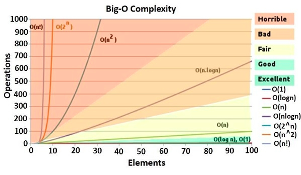

# 알고리즘이란?

- 수학과 컴퓨터 과학, 언어학 또는 관련 분야에서 어떠한 문제를 해결하기 위해 정해진 일련의 절차나 방법을 공식화한 형태로 표현한 것, 계산을 실행하기 위한 단계적 절차를 의미한다.
- 직관적으로 설명하면, 입력에서 출력까지의 중간 과정을 알고리즘 이라고 한다.

# Complexity, 복잡도

## Complexity?

1. Time Complexity( 시간 복잡도 ) : 실행하는데 필요한 시간 ( 처리 시간 )
2. space complexity( 공간 복잡도 ) : 메모리 ( 기억 공간 )와 파일 공간

# 좋은 알고리즘이란?

1. **Time Complexity** ( 시간 복잡도 )

2. **Space Complexity** ( 공간 복잡도 )

   

* 위의 __복잡도가 낮은 알고리즘__이 좋은 알고리즘이다.

* 어떤 과정을 처리하는데 __처리 시간이 짧을수록__, 컴퓨터의 __메모리를 적게 사용할수록__ 좋은 알고리즘

# Big O notation

- 알고리즘의 Time Complexity는 주로 Big-O notation을 사용하여 나타낸다.

* 빅-오 표기법(Big O notation)

  - 만약 엄청 큰 크기 n의 입력에 대한 알고리즘이 있는데, 이 알고리즘의 필요한 시간이 최대 (어떤 n0보다 크지 않은 모든 n에 대하여) 5**n^3** + 3*n*의 식을 가진다면, 이 알고리즘의 점근적 시간 복잡도는 O(*n^3*)이라고 할 수 있다.

  ==> n이 엄청 크다고 가정했을 때 n^3이 n보다 힘이 막강하게 쌔다! n은 무시당한다.

  

  > 

* 알고리즘의 성능평가 : **최선, 최악, 평균 유형(best, worst, average case)**
  알고리즘 분석에서, 최선의 경우는 생각하지 않는다. 평균의 경우와 최악의 경우가 가장 많이 활용. ( 알고리즘이 복잡해질수록 평균의 경우가 구하기가 어려워져서 ) **최악의 경우로 알고리즘 성능을 파악한다**.

( linear Search에서 검색해야 하는 리스트의 크기가 n이 된다. )

ex. A의 시간복잡도가 O(n), B의 시간 복잡도가 O(n^2)라고 하면, 

​      A보다 B의 시간 복잡도가 더 좋지 않다.

==> 쉽게 말하면 A의 알고리즘이 B의 알고리즘보다 (시간 복잡도의 측면에서 ) 더 효율적이다. 라고 이야기할 수 있다.

ex. Big O 계산법

- 만약 어떤 알고리즘의 시간 복잡도가 g(n) = 2n^2 + 3^n + 9 라고 한다면, Big O notation으로 정리하면, O(n^2)가 된다.

* 이것 이외에 small-o, Omega, Order 등이 있는데 이것은 제외 

  ( 알고리즘을 정~말 자세하게 공부해야 할 경우에는 알아야 한다. )

https://noahlogs.tistory.com/27

-------

## **빅오 표기법의 수학적 정의**

 

 빅오 표기법이 나타내는 의미는 수학적 정의를 통해 알 수 있다. 점근 표기법 중 빅오 표기법을 보통 가장 많이 사용하기 때문에 빅오 표기법의 수학적 정의 정도만 보고 넘어가자.

빅오 표기법의 수학적 정의는

   

 간단하게 예를들자면

 은 내가 만든 알고리즘의 시간 효율성(running time) 을 의미하고 충분히 큰 값인 n과 상수 k에 대해

 

 이라고 가정하면

 

  (  ) 가 성립하는 k 값이 존재하기 때문에 내가 만든 알고리즘  은 빅오 표기법을 사용하여 로 나타낼 수 있다.

출처: https://noahlogs.tistory.com/27 [인생의 로그캣]

> **빅오 표기법 성능비교**

 

 빅오 표기법에서 주로 사용되는 표기법은 아래 그래프와 같다.

 

 

그래프에 나와 있는 시간 복잡도의 성능을 비교하면 다음과 같다.

(왼쪽에서 오른쪽으로 갈수록 효율성이 떨어진다.)

​                              

faster   slower

 

( 상수함수 < 로그함수 < 선형함수 < 다항함수 < 지수함수 )

출처: https://noahlogs.tistory.com/27 [인생의 로그캣]
